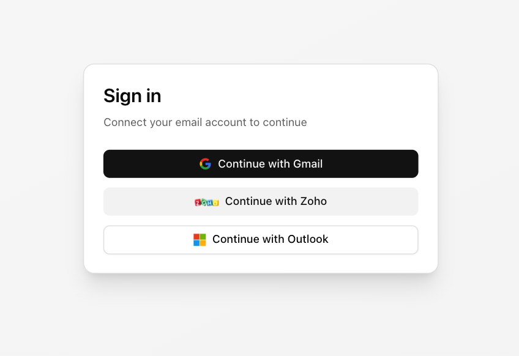
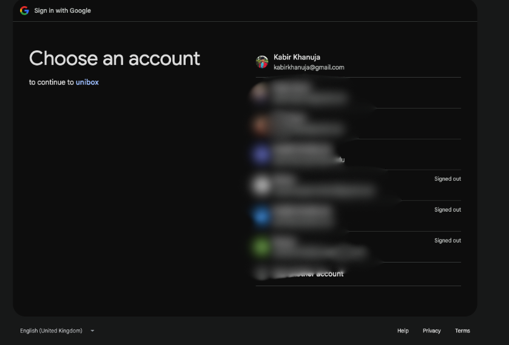
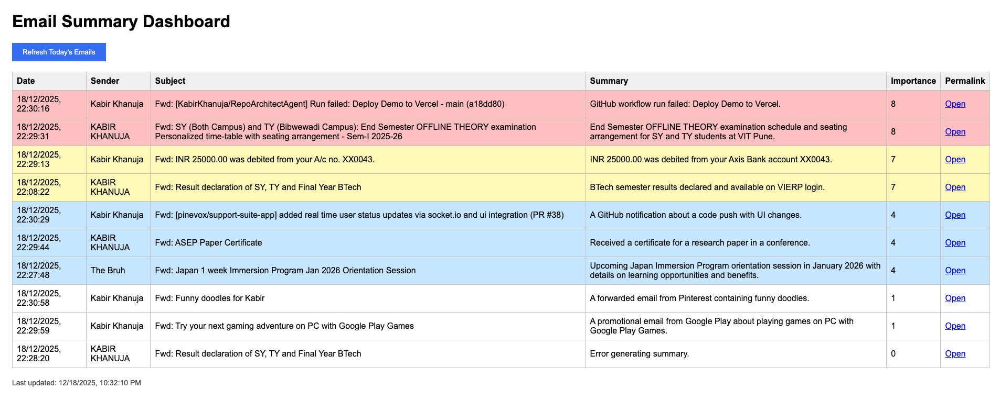

# unibox-sdk

It's a plug and play Node.js SDK for:

- Multi-provider email OAuth like Gmail, Zoho Mail, Outlook as of v0.1.1 (more coming soon, open for contributions!)
- Unified unread email fetching so that you get all unread emails across providers in a single format
- AI powered Inbox intelligence for automatic email summarization and importance ranking to save time and boost productivity

Build email connectivity into your app in minutes.

## Screenshots

You can add the sign in buttons in your frontend which redirect to the backend auth routes generated by Unibox



Oauth 2.0 flow is handled when you hit the auth routes


After signing in, you can fetch unread emails via HTTP or programmatically and with AI intelligence enabled, you'll get summaries and importance scores for each email



## Installation

```bash
npm i unibox-sdk
```

If you're using Express + env vars

```bash
npm i unibox-sdk express dotenv
```

Requirements:
- Node.js >= 18
- Express (declared as a peer dependency)

Though it supports both ESM and CommonJS:

```ts
import { createUnibox } from "unibox-sdk";
// or
const { createUnibox } = require("unibox-sdk");
```

## Gmail OAuth set up

### 1) Set env vars

Create a `.env`

```bash
GOOGLE_CLIENT_ID=your-google-client-id
GOOGLE_CLIENT_SECRET=your-google-client-secret
GOOGLE_REDIRECT_URI=http://localhost:3000/auth/gmail/callback
```

### 2) Create a server

`server.ts`

```ts
import express from "express";
import { createUnibox } from "unibox-sdk";
import "dotenv/config";

const app = express();

const unibox = createUnibox({
  providers: {
    gmail: {
      clientId: process.env.GOOGLE_CLIENT_ID!,
      clientSecret: process.env.GOOGLE_CLIENT_SECRET!,
      redirectUri: process.env.GOOGLE_REDIRECT_URI!,
    },
  },
});

app.use("/auth", unibox.router());

app.listen(3000, () => {
  console.log("Visit http://localhost:3000/auth/gmail");
});
```

### 3) Configure Google OAuth

In Google Cloud Console, add this redirect URI (assuming you'd have created an Oauth2 2.0 Client ID credential in apis and services > credentials)

```text
http://localhost:3000/auth/gmail/callback
```

### 4) Start OAuth

Open:

```text
http://localhost:3000/auth/gmail
```

## What Unibox creates

When mounted at `/auth`, Unibox generates routes like

```text
GET /auth/gmail
GET /auth/gmail/callback
GET /auth/gmail/unread?email=...
```

## Fetch unread emails

After a mailbox is connected (OAuth) you can fetch unread mail like this:

### Via HTTP

```bash
curl "http://localhost:3000/auth/gmail/unread?email=you@gmail.com"
```

### Programmatically

```ts
const emails = await unibox.fetchUnread({ provider: "gmail", email: "you@gmail.com" });
console.log(emails);
```

## Add more providers

```ts
createUnibox({
  providers: {
    gmail: { /* ... */ },
    zoho: {
      clientId: "...",
      clientSecret: "...",
      redirectUri: "...",
    },
    outlook: {
      clientId: "...",
      clientSecret: "...",
      redirectUri: "...",
    },
  },
});
```

## Set up for Zoho OAuth

`.env`:

```bash
ZOHO_CLIENT_ID=your-zoho-client-id
ZOHO_CLIENT_SECRET=your-zoho-client-secret
ZOHO_REDIRECT_URI=http://localhost:3000/auth/zoho/callback
```

In Zoho Developer Console, set redirect URI:

```text
http://localhost:3000/auth/zoho/callback
```

Start OAuth (Unibox auto-detects region from the email domain):

```text
http://localhost:3000/auth/zoho?email=you@zoho.in
```

Routes created when mounted at `/auth`:

```text
GET /auth/zoho?email=...
GET /auth/zoho/in?email=...
GET /auth/zoho/com?email=...
GET /auth/zoho/callback
GET /auth/zoho/unread?email=...
```

## Set up for Outlook OAuth

`.env`:

```bash
OUTLOOK_CLIENT_ID=your-outlook-client-id
OUTLOOK_CLIENT_SECRET=your-outlook-client-secret
OUTLOOK_REDIRECT_URI=http://localhost:3000/auth/outlook/callback
```

In Microsoft Entra (Azure) App Registration, add redirect URI (platform: Web):

```text
http://localhost:3000/auth/outlook/callback
```

Start OAuth:

```text
http://localhost:3000/auth/outlook
```

Routes created when mounted at `/auth`:

```text
GET /auth/outlook
GET /auth/outlook/callback
GET /auth/outlook/unread?email=...
```

## Enable AI inbox intelligence 

Automatically summarize and rank emails.

```ts
createUnibox({
  providers: { gmail: { /* ... */ } },
  intelligence: {
    enabled: true,
    llm: {
      provider: "openai", // or "groq" or "gemini"
      apiKey: process.env.OPENAI_API_KEY!,
      model: "gpt-4.1-mini",
    },
  },
});
```

When this is enabled, unread emails would include `summary` and `importanceScore`

## Token storage quick start

By default, Unibox uses an in-memory token store which by the way is great for local dev and testing. 
But when it comes to production, it's recommended that you pass a custom `tokenStore` (Redis). Don't keep tokens in production without a db. 

```ts
import type { TokenStore } from "unibox-sdk";

const store: TokenStore = {
  async get(provider, email) {
    // ...
  },
  async set(provider, email, tokens) {
    // ...
  },
  async delete(provider, email) {
    // ...
  },
};

createUnibox({
  providers: { gmail: { /* ... */ } },
  tokenStore: store,
});
```

## Next.js connect button

Basically, your frontend just needs to redirect the browser to your backend auth routes

```tsx
"use client";

export function ConnectButton({ provider }: { provider: "gmail" | "zoho" | "outlook" }) {
  return (
    <button type="button" onClick={() => (window.location.href = `/auth/${provider}`)}>
      Sign in with {provider}
    </button>
  );
}
```

## Response types

Without intelligence you get `UnifiedEmail[]`
With intelligence you get `EnrichedEmail[]`

```ts
type UnifiedEmail = {
  id: string;
  subject: string;
  from: string;
  date: string;
  body?: string;
  snippet?: string;
  permalink?: string;
  provider: "gmail" | "zoho" | "outlook";
  mailboxEmail: string;
};

type EnrichedEmail = {
  id: string;
  subject: string;
  from: string;
  date: string;
  permalink?: string;
  provider: "gmail" | "zoho" | "outlook";
  mailboxEmail: string;
  text: string;
  summary: string;
  importanceScore: number; // 1 to 10
};
```

## Production notes

- Use HTTPS in production (OAuth providers often require it, so maybe use nginx or something as a reverse proxy to add TLS)
- Do not use the in-memory token store in production
- Treat tokens as secrets
- Protect `/auth/*` routes (rate limits, CSRF where relevant)
- If you run multiple instances then use shared token storage
